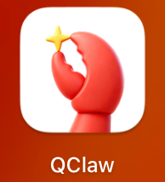

# 首次接触Harness

某天，我的同事丢了2个文件过来，一个word，一个excel，并撂下一句话：“客户希望做一个智能体，然后每次编写文档，就按照这个word的格式来写，数据就从excel读取”。
“得嘞”，收到任务的我，心里想着现在有AI，充值就能解决所有问题。
但一段时间过去后，我发现事情并没有那么简单。前期尝试使用一个搭建好的智能体平台，通过组合技能、编排等进行输出报告，但发现很多时间花在“驱动AI编写、调试代码”上，最终输出的效果不太理想。
甚至一度陷入沉思：
我得是这方面的专家，我才能想得出来怎么组织数据，分析套路是什么，怎样的行文才符合
这一段代码真的是解决这个问题的吗？（不管了，先运行看看，看输出的结果对不对）
这么复杂的代码逻辑，零散的功能点，如果客户想要调整某个维度（数据来源、分析套路），他应该怎么做，我怎么交付最终结果（可用的功能）给用户，最终自己轻松脱手呢？
AI还不够强，应该还无法完成这个任务吧
我认为这是个伪需求！

就这么放弃了吗？隔壁老汤（产经）拍了拍我，准备传功：你这样，然后这样，最终这样，就可以了。
然后，我再次陷入沉思。直到我眼睛注视到了我电脑屏幕有一个

好了，故事开始了。